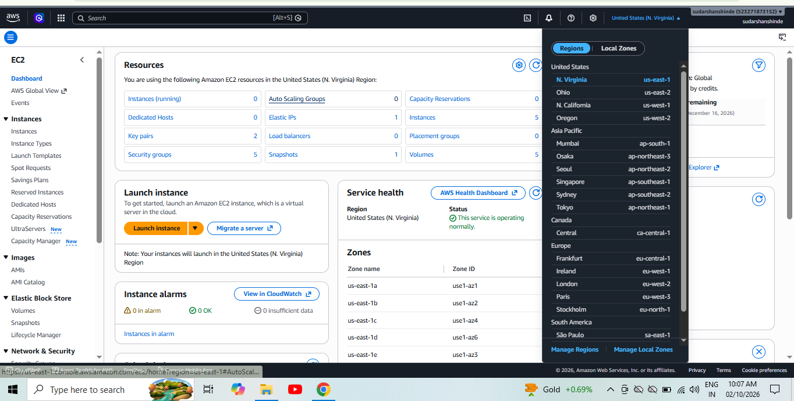
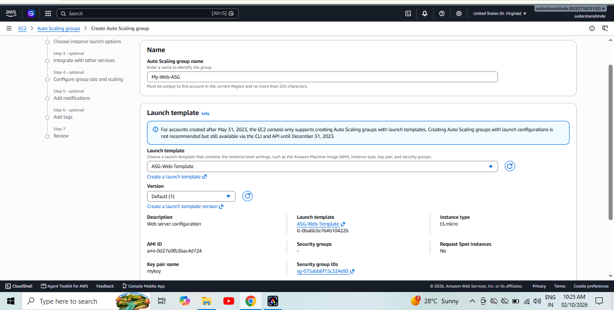
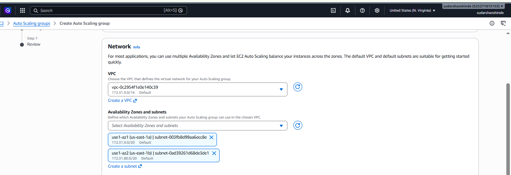
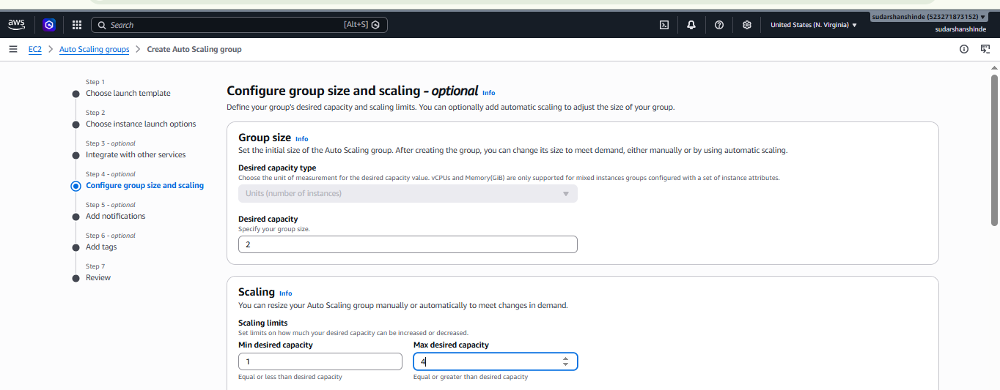
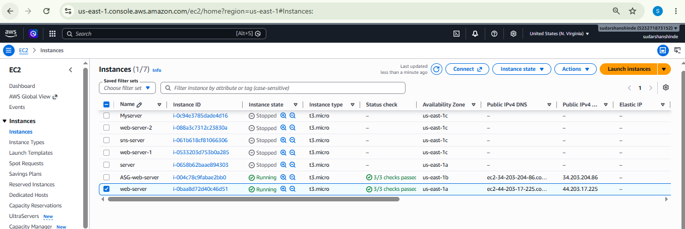
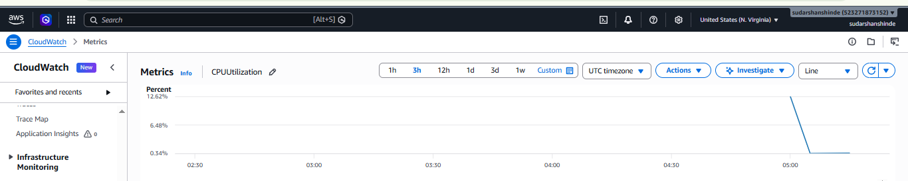

# EC2 Auto Scaling Environment Using an EC2 Launch Template

### Objective

Configure an EC2 Auto Scaling environment using an EC2 Launch Template,
an Auto Scaling Group, and CloudWatch metrics. The environment launches
a Linux web server automatically and demonstrates capacity changes.

### AWS Services

-   Amazon EC2
-   EC2 Launch Template
-   EC2 Auto Scaling Group
-   Amazon CloudWatch
-   EC2 Security Groups

### Architecture
```text
User / Browser
      ↓
   Internet
      ↓
Security Group
      ↓
┌─────────────────────────────────────┐
│       EC2 Auto Scaling Group        │
│                                     │
│  EC2-1       EC2-2       EC2-N      │
│ Apache       Apache      Apache     │
│                                     │
│ Min: 1 | Desired: 2 | Max: 4       │
└─────────────────────────────────────┘
      ↓
 CloudWatch
 CPU Utilization
      ↓
Target Tracking
 Target CPU 50%
      ↓
Auto Scaling Group
      ↺
Scale In / Scale Out
```

### Configuration
AWS EC2 Auto Scaling Configuration

1. AWS Region

- AWS Region: "us-east-1 (N.Virginia)"
- Service Used: Amazon EC2, Auto Scaling, CloudWatch

2. Security Group Configuration

- Security Group: Web Server Security Group
- Inbound Rule 1: SSH (Port 22) – My IP
- Inbound Rule 2: HTTP (Port 80) – 0.0.0.0/0
- Outbound Traffic: All traffic allowed

3. Launch Template Configuration

- Launch Template Name: "WebServer-Launch-Template"
- AMI: Amazon Linux 2023
- Instance Type: "t2.micro" (or the instance type selected)
- Key Pair: Selected EC2 Key Pair
- Security Group: Web Server Security Group
- User Data: Install and start Apache HTTP Server automatically.

4. Auto Scaling Group Configuration

- Auto Scaling Group Name: "WebServer-ASG"
- Launch Template: WebServer-Launch-Template
- Minimum Capacity: 1
- Desired Capacity: 2
- Maximum Capacity: 4
- Network: Selected VPC and subnets
- Health Check Type: EC2
- Health Check Grace Period: 300 seconds

5. Scaling Policy Configuration

- Policy Type: Target Tracking Scaling
- Metric: Average CPU Utilization
- Target Value: 50%
- Instance Warmup: 300 seconds

The Auto Scaling Group automatically adjusts the number of EC2 instances based on CPU utilization, within the configured minimum and maximum capacity.

6. Web Server Configuration

- Web Server: Apache HTTP Server
- HTTP Port: 80
- Web Page: Welcome to AWS Auto Scaling Project
- User Data installs Apache, enables the service, and creates the web page automatically when an instance launches.

7. CloudWatch Monitoring

- Monitoring Service: Amazon CloudWatch
- Metric: CPUUtilization
- Metric Dimension: Auto Scaling Group / EC2 Instance
- Purpose: Monitor CPU utilization and observe scaling behavior.

8. Testing and Verification

1. Verify that the desired number of EC2 instances is running.
2. Open the public IPv4 address of an instance in a browser.
3. Confirm that the web page is displayed.
4. Generate CPU load if required for testing.
5. Monitor CPU utilization in CloudWatch.
6. Verify scaling activity and instance count changes in the Auto Scaling Group.


### Screenshots


### 1. AWS Region Configuration


### 2. Security Group Configuration


### 3. Launch Template Creation


### 4. Launch Template Review


### 5. Auto Scaling Group Configuration


### 6. VPC and Networking Configuration


### 7. Auto Scaling Capacity Settings


### 8. Desired Capacity Configuration


### 9. EC2 Instance Deployment


### 10. Instance Running Status


### 11. Cloudwatch Monitoring Graph
            

### Conclusion

This project demonstrates automated EC2 provisioning and capacity
management using AWS Auto Scaling and CloudWatch. Record only scaling
actions and test outcomes that were actually observed.

.
